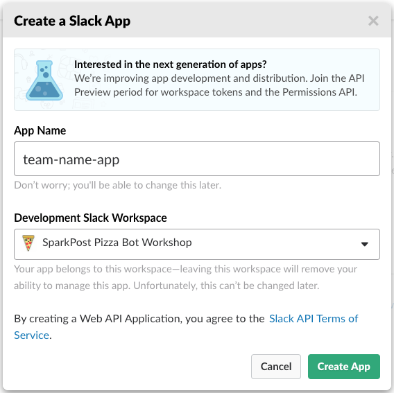
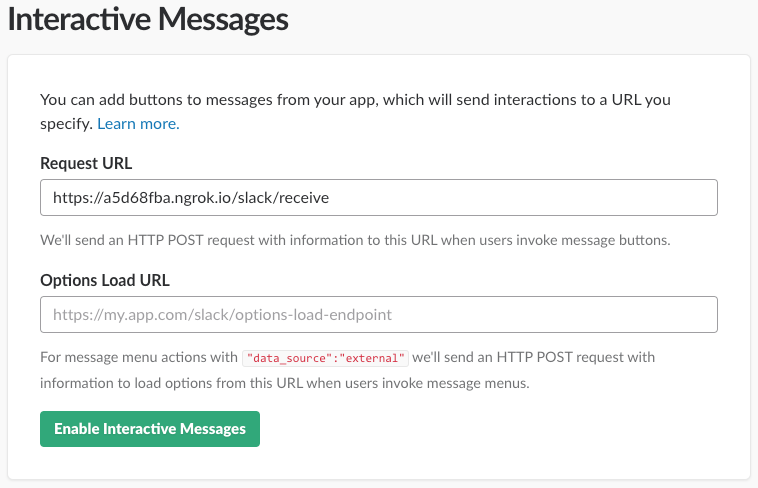
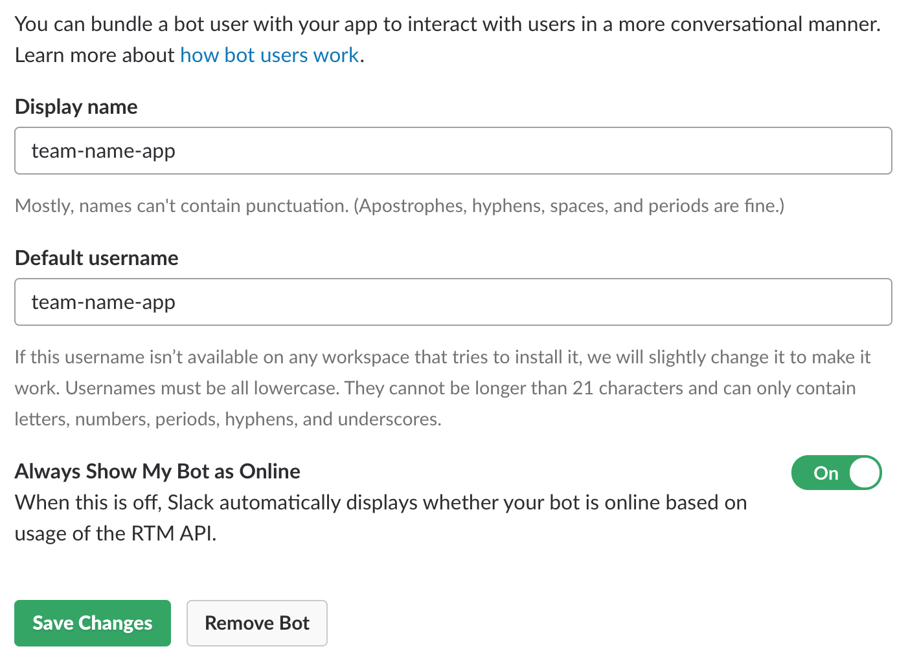
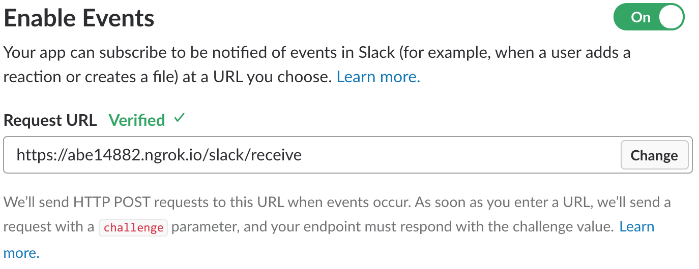
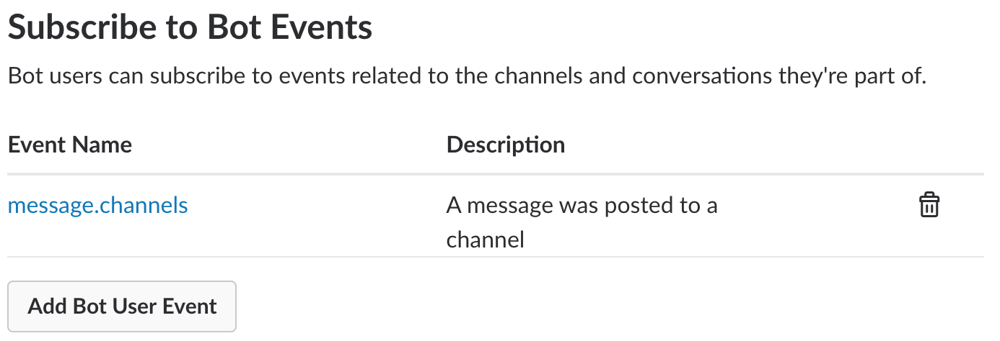
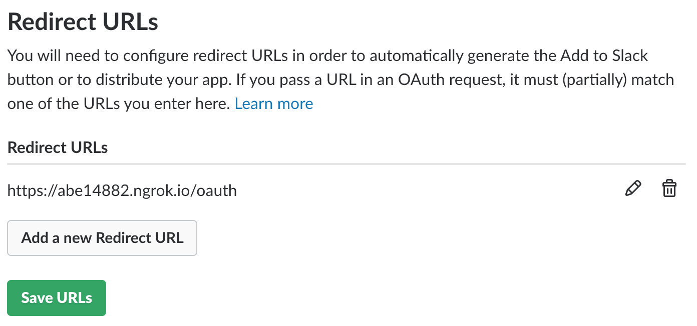
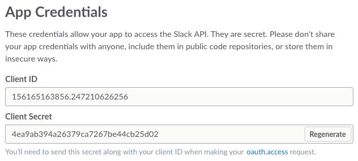

# Creating a Slack App
Follow these steps to generate the `CLIENT_ID`, `ClIENT_SECRET`, and activation URL needed to create your slack app. You'll need the URL returned from ngrok.
1. Go to https://api.slack.com/apps
2. Click “Create New App”
3. Enter the team name + ‘-app’ for the App Name and select “SparkPost Pizza Bot Workshop” as the Development Slack Workspace

4. Click “Create App”
5. Under “Add features and functionality”, click “Interactive Components”
6. Click “Enable Interactive Messages”
7. Enter their ngrok url + ‘/slack/receive’ as the Request URL

8. Click “Enable Interactive Messages”
9. Click on “Basic Information” on the left and expand “Add features and functionality”
10. Click “Bots”
11. Click “Add Bot User”
12. Set the Display name and Default username to the team name + ‘-app’
13. Set the “Always Show My Bot as Online” toggle to “On”

14. Click “Add Bot User”
15. Click on “Basic Information” on the left and expand “Add features and functionality”
16. Click “Event Subscriptions”
17. Click the toggle to “On”
18. Enter their ngrok url + ‘/slack/receive’ as the Request URL
19. You should see Verified appear after you enter it.

20. Under “Subscribe to Bot Events” Click “Add Bot User Event”
21. Type message.channels and hit Enter

22. Click “Save Changes” at the bottom of the page
23. Click on “Basic Information” on the left and expand “Add features and functionality”
24. Click “Permissions”
25. Add a Redirect URL for their ngrok url + ‘/oauth’

26. Click “Save URLs”
27. Click on “Basic Information” on the left and expand “Install your app to your workspace”
28. Click “Install App to Workspace”
29. Click on “Basic Information” on the left. Scroll down to App Credentials and click “Show” next to the Client Secret

30. Copy the Client ID and Client Secret and add them to your `.env` file.
31. Create the Authorization URL by replacing the CLIENT_ID
https://slack.com/oauth/authorize?team=T4L4V4TR6&scope=bot&client_id=CLIENT_ID
