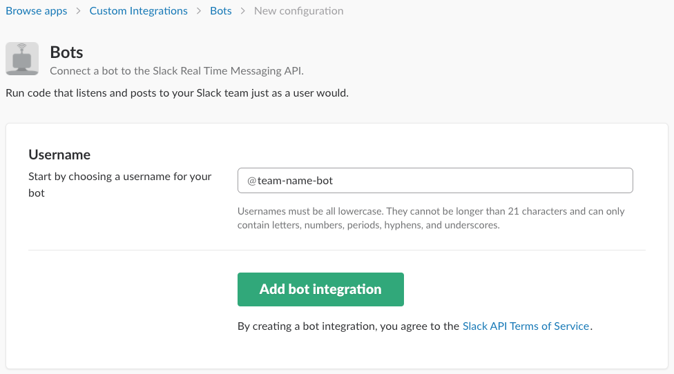
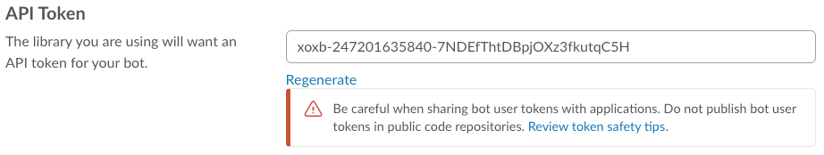

# Creating a Slack Bot
Follow these steps to generate a Slack API Token needed to create your Slack Bot.

1. Go to [Bot New Configuration Page](https://sparkpostpizzabot.slack.com/apps/new/A0F7YS25R-bots).
2. Enter your team name + '-bot' for the bot name.

3. Click "Add bot integration"
4. Copy the API Token and paste it in your .env file.

5. Scroll to the bottom of the page and click "Save Integration"
